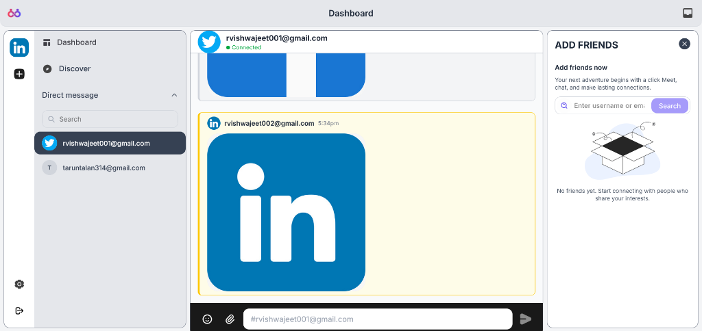
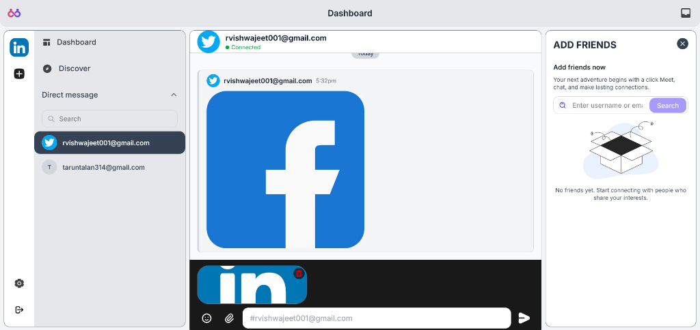
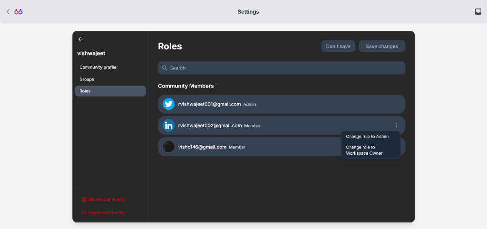

# SpaceHUB

SpaceHUB is a modern, responsive web application built with React and Vite that provides a seamless dashboard experience for managing user activities and profile settings. Whether you're tracking performance metrics or managing personal data, SpaceHUB offers a robust and intuitive interface.

## 🚀 Features

### Core Modules
-   **Secure Authentication**: robust login and registration system (`modules/auth`) to keep user data safe.
-   **Interactive Dashboard**: A centralized command center (`modules/dashboard`) for monitoring key metrics and activities.
-   **User Profile Management**: Comprehensive tools (`modules/profile`) for users to customize their experience and settings.

### Technical Excellence
-   **Real-time Capabilities**: Integrated real-time updates using SockJS and StompJS for live data interaction.
-   **Modular Architecture**: Clean, scalable codebase organized by feature modules for easy maintenance.
-   **High Performance**: Powered by Vite for instant server starts and lightning-fast HMR (Hot Module Replacement).

### Screenshots






### User Experience
-   **Responsive Design**: A fluid interface built with Tailwind CSS that works perfectly on desktop, tablet, and mobile.
-   **Intuitive Navigation**: Clear routing and layout ensure users can find what they need without confusion.
-   **Modern Aesthetics**: Clean, minimalistic design focused on usability and readability.

### Community & Growth
-   **Open Source**: Built with community contribution in mind.
-   **Scalable Foundation**: Designed to grow with new features and modules easily added.
-   **User-Centric**: Continuous improvements based on user feedback and needs.

## 🛠️ Tech Stack

-   **Frontend**: React, Vite
-   **Styling**: Tailwind CSS v4
-   **State Management**: Redux Toolkit
-   **Routing**: React Router DOM
-   **Real-time Communication**: SockJS, StompJS
-   **HTTP Client**: Axios
-   **Icons**: Lucide React

## 🏗️ Architecture

SpaceHUB follows a modular architecture:

-   **Feature-based Modules**: Distinct modules for Auth, Dashboard, and Profile to encapsulate logic.
-   **Shared Resources**: Common components, hooks, and services reused across the application.
-   **Service Layer**: Abtracted API calls for clean separation of concerns.

## 🚦 Getting Started

### Prerequisites

-   Node.js
-   npm or yarn
-   Git

### Installation

1.  Clone the repository
    ```bash
    git clone https://github.com/yourusername/spacehub-frontend.git
    cd spacehub-frontend
    ```

2.  Install dependencies
    ```bash
    npm install
    ```

3.  Start the development server
    ```bash
    npm run dev
    ```

4.  Open [http://localhost:5173](http://localhost:5173) (or the port shown in your terminal) in your browser.

## 📘 Usage

1.  **Register/Login**: optimized authentication flow.
2.  **Explore Dashboard**: specific widgets and data visualizations.
3.  **Update Profile**: settings and preferences in the profile section.

## 🛣️ Roadmap

-   [ ] Mobile application wrapper
-   [ ] Expanded real-time notification system

## 🤝 Contributing

We welcome contributions from the community! To contribute:

1.  Fork the repository
2.  Create your feature branch (`git checkout -b feature/amazing-feature`)
3.  Commit your changes (`git commit -m 'Add some amazing feature'`)
4.  Push to the branch (`git push origin feature/amazing-feature`)
5.  Open a Pull Request

## ❓ Troubleshooting

**Q: The page isn't loading?**
A: Ensure the backend service (if applicable) is running and accessible.

**Q: Real-time updates aren't working?**
A: Check your network connection and ensure the WebSocket server is reachable.

## 👏 Acknowledgements

-   [React](https://react.dev/)
-   [Vite](https://vitejs.dev/)
-   [Tailwind CSS](https://tailwindcss.com/)

## 📬 Contact

For questions or support, please reach out to [vishwajeetrajput282@gmail.com](mailto:vishwajeetrajput282@gmail.com)

---

<p align="center">
  Made with ❤️ by Vishwajeet Singh
</p>
